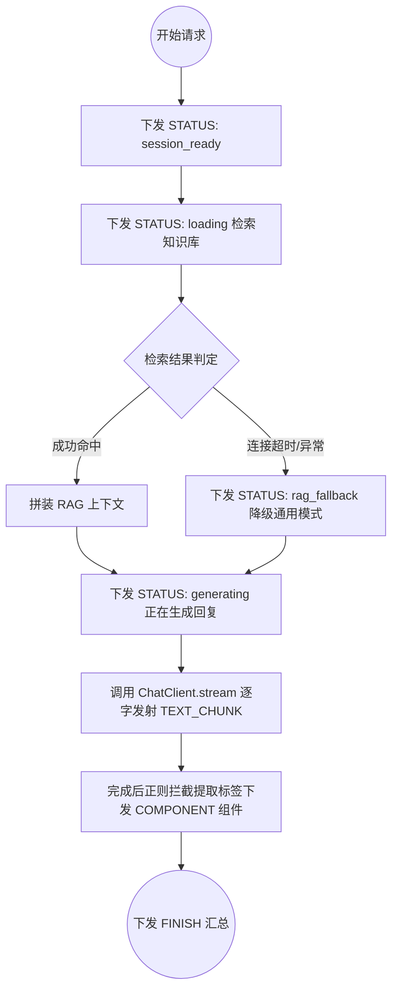
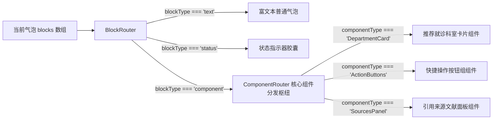

# 医护到家 AI 健康助手：全链路架构与设计深度解析

本文档旨在全面且细致地介绍「医护到家」项目中智能问诊（AI 健康助手）模块的技术方案。该方案抛弃了传统的非结构化纯文本流，深度结合了 **Vercel AI SDK** 与 **OpenAI Responses API** 的设计哲学，基于**统一信封模式 (Envelope Pattern)** 构建了一套跨平台兼容、前后端高度解耦、支持生成式动态 UI（Generative UI）的健壮流式响应架构。

---

## 一、 核心设计理念与背景

### 1.1 传统 SSE 流式方案的痛点
在传统的 AI 聊天实现中，后端通常通过 Server-Sent Events (SSE) 直接推送纯文本片段，或是利用原生的 `event:` 标识不同的动作（例如 `event: message`、`event: error`）。这种做法在复杂业务中暴露出了严重缺陷：
* **前端陷入“正则地狱”**：前端为了在文本流中解析推荐科室、建议操作等指令，不得不编写复杂的正则表达式，极易出现截断截取不全或标签闪烁的问题。
* **跨端兼容性差**：部分小程序环境或旧版移动端 WebView 容器对自定义 `event:` 头部支持受限，只能接收标准的 `data:` 报文。
* **状态模糊**：前端难以精准掌握 AI 当前究竟处于“正在检索库”、“正在推理思考”还是“生成完毕”的状态，界面呈现生硬。

### 1.2 破局之道：统一信封模式 (Envelope Pattern)
为了解决上述痛点，我们规定**所有流式事件统一走单一的 `data:` 数据通道**，每一帧的数据均序列化为标准、统一的 JSON 结构（即“信封”）。路由与动作分发完全由 JSON 内核的 `type` 字段驱动。

```json
{
  "chunkId": "chk_898a06d8",
  "type": "TEXT_CHUNK",
  "data": { "text": "发热" },
  "metadata": { "timestamp": 1778660405773 }
}
```

通过将数据包装在一致的外壳下，前端只需单点 `JSON.parse` 并执行简单的 `switch(chunk.type)`，即可完美覆盖从状态过度到富文本打字机、再到生成式动态卡片的任意场景。

---

## 二、 五大核心信封类型定义

系统收敛出 **5 种绝对互斥且完备的 Type**，涵盖生命周期的每一个切面：

| 信封类型 (`type`) | 载荷结构 (`data`) | 适用业务场景与前端动作 |
| :--- | :--- | :--- |
| **`STATUS`** | `{ status, message }` | **状态流转**：如会话初始化、正在检索知识库 (`loading`)、知识库降级 (`rag_fallback`) 等，前端渲染顶部状态胶囊。 |
| **`TEXT_CHUNK`** | `{ text }` | **大模型文本接龙**：流式吐出的回答片段，前端驱动文本打字机效果。 |
| **`COMPONENT`** | `{ componentType, props, actions }` | **生成式 UI (Generative UI)**：由后端决定下发何种富交互组件，并注入所需参数及点击回调。 |
| **`ERROR`** | `{ code, message, level }` | **异常中断**：捕获鉴权、调用限流或数据库异常，前端终止流式状态并展示友好的错误提示。 |
| **`FINISH`** | `{ sessionId, fullText, stopReason }` | **终态汇总**：流式传输正常结束。附带后端清洗后的纯净全量文本与 Token 消耗，前端全量覆盖避免残存标签。 |

---

## 三、 后端架构与实现机制

后端基于 **Spring Boot 3.3 + Spring AI 1.1.5 + Project Reactor** 构建，深度运用了响应式编程范式确保高并发吞吐。

### 3.1 控制器层 (`AiController`)
* **纯净 data 输出**：声明 `produces = MediaType.TEXT_EVENT_STREAM_VALUE` 返回响应式流 `Flux<String>`。
* **避免重复装箱**：Spring WebFlux 底层的 SSE 编码器会自动对吐出的每一个纯字符串包装 `data:` 前缀与末尾换行符。因此控制器内部直接输出 `objectMapper.writeValueAsString(chunk)`，从源头杜绝了 `data:data:{...}` 的双重封装破损问题。

### 3.2 服务层状态驱动 (`HealthAiService`)
基于 `Sinks.Many<StreamChunk>` 实现细粒度的生命周期广播控制：



### 3.3 向量数据库优雅解耦设计 (`VectorStoreConfig`)
项目中主业务采用 MySQL 数据库。Spring AI 的 `PgVectorStoreAutoConfiguration` 自动装配时默认会捕获全局唯一的 `DataSource`，从而尝试在 MySQL 连接上执行 PostgreSQL 特有的向量搜索语法（如 `<=>`），引发 `bad SQL grammar` 崩溃。

**高级隔离方案**：
1. **启动器规避**：在 `@SpringBootApplication(exclude = { PgVectorStoreAutoConfiguration.class })` 中显式剔除默认装配行为。
2. **内部私有构造**：编写自定义的 `VectorStoreConfig`，在工厂方法内部单独读取 `pgvector.datasource` 属性手动创建 PostgreSQL 的 `DataSource` 对象并传给底层的 `JdbcTemplate`。该内部数据源**绝不暴露为 Spring 容器中的 `@Bean`**，完美避免了与全局 MySQL 主数据源的互相覆盖与干扰。

---

## 四、 前端架构与声明式渲染引擎

前端基于 **React 18 + TypeScript + Tailwind CSS** 构建，采用高度解耦的**动态插槽引擎**设计。

### 4.1 统一流式解析中间件 (`api.ts`)
网络请求模块使用原生的 `fetch` 结合 `TextDecoder` 读取流二进制流，按 HTTP 协议规范将数据帧按照双换行符 `\n\n` 进行精准切割，剔除 `data:` 头部后经过安全的 `JSON.parse` 装箱成标准 `StreamChunk`，最终流入单一路由枢纽 `dispatchChunk`，将具体行为多态分发至回调函数组。

### 4.2 声明式动态渲染引擎 (`AiScreen.tsx`)
核心 UI 渲染不写死任何具体业务卡片，而是依托于两级路由组件层层代理映射：



### 4.3 不可变更新与 StrictMode 防御机制
在 React StrictMode 下，状态更新函数会连续执行两次以探测副作用。
* **避免原地修改**：我们在处理流式追加时，避免使用 `textBlock.content += data.text` 导致文字累加加倍的恶性 Bug。而是坚持构造全新的对象地址引用：`{ ...oldBlock, content: oldBlock.content + data.text }`。
* **终态清洗保障**：在接收到 `FINISH` 事件时，直接使用后端传回的纯净版 `fullText` 全量覆盖本地流式拼接文本，确保不会在屏幕上残留任何尖括号标签。

---

## 五、 未来功能卡片扩展指南（以新增优惠券为例）

本架构具备完美的开闭原则 (OCP)。假设 3 个月后运营要求在 AI 对话中为符合条件的用户动态发放服务优惠券卡片，开发流程仅需两步：

### 5.1 后端添加一行推送指令
后端服务仅需在合适时机调用 Sinks 推送携带自定义载荷的组件信封：
```java
sink.tryEmitNext(StreamChunk.component(
    "CouponCard", 
    Map.of("amount", 50, "title", "新用户专享上门服务抵用券"),
    Map.of("onClaim", Map.of("type", "API_CALL", "target", "/api/v1/coupons/claim"))
));
```

### 5.2 前端添加一行映射组件
在前端 `AiScreen.tsx` 的 `ComponentRouter` 组件内部追加一个 switch 映射分支即可：
```tsx
case 'CouponCard':
  return <CouponCardComponent props={block.props} actions={block.actions} />;
```

**核心 SSE 传输协议、流解析中间件、以及会话状态机代码均做到完全零修改！** 这种后端驱动生成式界面的范式极大提升了前端面对频繁业务变更时的吞吐力和响应力。
