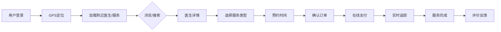

<div align="center">

# 🏥 医护到家 — Family Doctor

**基于 LBS 定位的上门医疗服务平台**

让专业医疗服务走进千家万户

[](https://react.dev/)
[](https://typescriptlang.org/)
[](https://vitejs.dev/)
[](https://tailwindcss.com/)
[](https://ai.google.dev/)

</div>

---

## 📖 项目简介

**医护到家**是一款面向 C 端用户的 O2O 上门医疗服务平台前端应用，类似于"医疗版美团"。用户打开 App 后，系统自动定位当前地址，加载附近可用的医生和医疗服务资源，用户可按需选择上门问诊、视频问诊、上门护理、上门输液等多种服务，完成在线预约、支付和订单管理的完整闭环。

平台同时集成了 **AI 智能健康助手**（基于 Google Gemini），为用户提供症状初筛、智能分诊和健康咨询等增值服务。

## 🎯 核心业务流程

```
用户登录 → 定位加载附近资源 → 浏览/搜索医生和服务 → 选择服务类型 → 预约下单 → 在线支付 → 实时订单追踪 → 服务完成 → 评价反馈
```



## ✨ 功能模块

### 🏠 首页 (HomeScreen)
- **LBS 定位地址栏**：自动获取用户位置，显示当前服务地址，支持手动切换
- **智能搜索**：支持按医生姓名、科室、症状关键词搜索
- **Banner 推荐**：展示平台推荐、活动信息
- **快捷入口**：预约挂号、上门服务、健康咨询、AI 问诊四大入口
- **热门服务**：上门问诊、上门输液、上门护理、上门体检、母婴护理、伤口换药等 6 大核心服务
- **附近医生**：基于定位展示附近可用医生，显示距离、在线状态、是否支持上门

### 🔍 搜索 (SearchScreen)
- **科室筛选**：全部科室、全科、儿科、内科、老年科、中医科、皮肤科等
- **智能排序**：综合排序、距离最近
- **服务过滤**：支持上门 / 视频问诊 复选过滤
- **医生列表**：展示在线状态、评分、专业标签、距离、服务方式
- **加载更多**：分页加载

### 👨‍⚕️ 医生详情 (DoctorDetailScreen)
- **医生资料卡**：头像、姓名、职称、所属医院、在线状态
- **专业标签**：心血管内科、高血压管理、冠心病预防等
- **数据统计**：从业年限、患者评分、服务人次
- **服务选择**：上门看诊 / 视频问诊 / 电话咨询，带价格和选中状态交互
- **患者评价**：真实评价展示，含星级评分、服务类型、时间
- **底部操作**：在线咨询 + 立即预约

### 📅 预约下单 (BookingScreen)
- **服务类型选择**：上门服务 / 视频问诊
- **时间选择**：日历式时间选择器
- **地址确认**：服务地址展示

### 📋 订单确认 (OrderConfirmationScreen)
- **服务明细**：医生信息、服务类型、预约时间、服务地址
- **支付方式**：微信支付 / 支付宝 / 余额支付（可交互切换）
- **费用展示**：服务费用高亮显示
- **取消规则**：2小时以上全额退款 / 不足2小时收50%违约金 / 出发后不可取消
- **立即支付**：底部固定操作栏

### 📦 订单管理 (OrdersScreen)
- **状态 Tab 切换**：待服务 / 进行中 / 已完成 / 已取消
- **待服务订单**：倒计时提醒、取消订单 / 查看详情操作
- **进行中订单**：实时状态追踪（"护士已出发，预计10分钟到达"）、联系护士 / 实时位置

### 📄 订单详情 (OrderDetailScreen)
- **状态横幅**：彩色状态指示（待服务/进行中/已完成）
- **医生信息**：含在线聊天入口
- **订单信息**：预约时间、服务类型、支付方式、订单编号（可复制）
- **费用明细**：基础费用、会员折扣、实付金额
- **操作按钮**：取消订单 / 进入问诊

### 🤖 AI 健康助手 (AiScreen)
- **智能对话**：基于 Google Gemini 的多轮健康咨询
- **快捷问题**：发热怎么办、附近全科医生、解读化验单
- **生成式 UI**：AI 返回结构化分诊建议卡片（推荐科室、紧急提醒）
- **一键预约**：AI 建议后可直接预约对应医生
- **语音输入**：支持语音转文字输入
- **浮动入口**：首页右下角 FAB 按钮，带呼吸动画

### 👤 个人中心 (ProfileScreen)
- **用户信息**：头像（在线状态）、姓名、手机号、编辑入口
- **钱包**：余额、积分、账户明细
- **快捷导航**：历史订单、优惠券管理（含可用数量徽章）
- **账户管理**：个人信息管理、地址管理、设置

### ⚙️ 设置 (SettingsScreen)
- **通知设置**：推送通知、订单状态更新、营销活动推送（独立开关）
- **隐私与安全**：修改密码、隐私协议、用户服务协议
- **显示设置**：深色模式切换、字体大小选择（小/标准/大）
- **其他**：语言设置、清除缓存、意见反馈、关于医护到家
- **退出登录**

### 📍 其他页面
- **地址管理**：服务地址的增删改查
- **消息中心**：系统通知、订单消息
- **服务评价**：星级评价 + 文字反馈
- **支付成功**：支付结果展示

## 🏗️ 技术架构

| 层级 | 技术 | 说明 |
|------|------|------|
| **框架** | React 19 + TypeScript 5.8 | 函数式组件 + Hooks |
| **构建** | Vite 6 | 极速 HMR 开发体验 |
| **路由** | React Router DOM 7 | SPA 客户端路由 |
| **样式** | Tailwind CSS 4 | 原子化 CSS，Material Design 3 色彩系统 |
| **图标** | Lucide React | 轻量矢量图标库 |
| **AI** | Google Gemini (@google/genai) | AI 健康助手智能对话 |
| **动画** | Motion (Framer Motion) | 页面过渡和微交互动画 |
| **工具** | clsx + tailwind-merge | 条件样式合并 |

### 设计系统

项目采用 **Material Design 3** 色彩体系，定义了完整的语义化色彩 Token：

- **Primary**：`#004E9F` — 品牌蓝，用于导航、按钮、链接
- **Secondary**：`#006C4B` — 辅助绿，用于在线状态、成功提示
- **Tertiary**：`#883700` — 强调橙，用于评分、警告
- **Error**：`#BA1A1A` — 错误红，用于删除、退出、紧急提示
- **Surface 系列**：多层级表面色，构建卡片层次感

## 🚀 快速开始

### 环境要求

- Node.js >= 18
- npm >= 9

### 安装运行

```bash
# 克隆仓库
git clone https://github.com/sangyy2/Family-Doctor.git
cd Family-Doctor

# 安装依赖
npm install

# 配置环境变量（AI 功能需要）
cp .env.example .env.local
# 编辑 .env.local，填入你的 GEMINI_API_KEY

# 启动开发服务器
npm run dev
```

应用将在 `http://localhost:3000` 启动。

### 构建部署

```bash
# 生产构建
npm run build

# 本地预览
npm run preview
```

## 📁 项目结构

```
医护到家/
├── src/
│   ├── App.tsx                          # 路由配置 + 底部导航 + AI FAB
│   ├── main.tsx                         # 应用入口
│   ├── index.css                        # 全局样式 + 设计 Token + 动画
│   ├── lib/
│   │   └── utils.ts                     # 工具函数 (cn)
│   └── screens/
│       ├── HomeScreen.tsx               # 首页（定位 + 服务 + 医生）
│       ├── SearchScreen.tsx             # 搜索（筛选 + 排序 + 医生列表）
│       ├── DoctorDetailScreen.tsx       # 医生详情（资料 + 服务 + 评价）
│       ├── BookingScreen.tsx            # 预约服务
│       ├── OrderConfirmationScreen.tsx  # 订单确认（支付方式 + 规则）
│       ├── OrdersScreen.tsx             # 订单列表（Tab + 实时追踪）
│       ├── OrderDetailScreen.tsx        # 订单详情（费用 + 状态）
│       ├── AiScreen.tsx                 # AI 健康助手
│       ├── ProfileScreen.tsx            # 个人中心
│       ├── SettingsScreen.tsx           # 设置（通知/隐私/显示）
│       ├── AddressManagementScreen.tsx  # 地址管理
│       ├── MessagesScreen.tsx           # 消息中心
│       ├── FeedbackScreen.tsx           # 服务评价
│       └── PaymentSuccessScreen.tsx     # 支付成功
├── index.html
├── package.json
├── tsconfig.json
├── vite.config.ts
└── .env.example
```
 

# 全栈联调对接清单

## 当前状态总览

| 模块 | 状态 | 说明 |
|------|------|------|
| 前端 Vite 服务 | ✅ 运行中 | localhost:3000 |
| API Proxy 配置 | ✅ 已配置 | /api → localhost:8080 |
| 登录页面 | ✅ 渲染正常 | /login |
| 路由守卫 | ✅ 已生效 | 未登录自动跳转 /login |
| 后端 Spring Boot | ⏳ 待启动 | 需运行 FamilyDoctorApplication.java |

---

## 说明
| 文件 | 说明 |
|------|------|
| `src/screens/LoginScreen.tsx` | 精美的手机号登录页（MVP 验证码固定 `123456`） |
| `App.tsx` | 包裹 AuthProvider，添加 ProtectedRoute 路由守卫 |
| `SearchScreen` | 接入 `GET /doctors` 实时搜索 + 分页 |
| `ProfileScreen` | 读取真实用户数据 + 退出登录 |
| `AiScreen` | 接入后端 SSE 流式 AI 对话 |
| `AddressManagementScreen` | 接入地址 CRUD API |
| `MessagesScreen` | 接入通知 API + 标记已读 |
| `src/lib/api.ts` | 统一 API 客户端，涵盖所有 13 个后端接口，JWT 自动附加 + 401 自动跳登录 |
| `src/lib/auth.tsx` | AuthProvider 上下文，管理登录态，启动时自动校验 Token |
| `vite.config.ts` | `/api` 反向代理到 `localhost:8080`，开发无跨域 |

---

## 联调步骤

**在 IDEA 中运行 `FamilyDoctorApplication.java`**，启动 Spring Boot 后端后，前端即可直接通过 Proxy 连接后端，完成全链路联调。


## 📄 License

MIT License

---

<div align="center">

**医护到家** — 让优质医疗服务，触手可及 🏥

</div>
