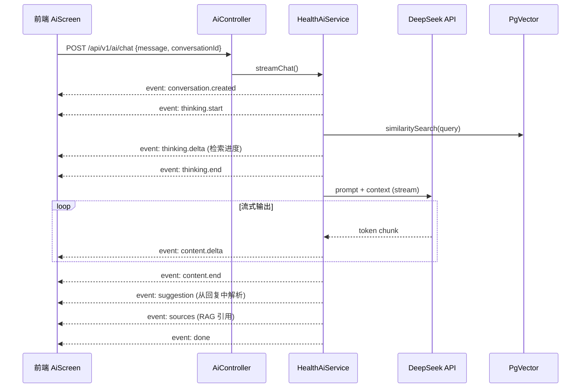

# AI Chat 结构化 SSE 协议 — 设计与实现

## 1. 架构概览



## 2. SSE 事件类型

| Event | 阶段 | Payload 关键字段 | 前端渲染 |
|---|---|---|---|
| `conversation.created` | 初始化 | `conversationId` | 记录会话 ID |
| `thinking.start` | 思考 | `text` | 紫色渐变卡片 + 脑图标动效 |
| `thinking.delta` | 思考 | `text` | 追加思考行，三点呼吸动画 |
| `thinking.end` | 思考 | — | 800ms 后自动折叠 |
| `content.delta` | 回复 | `text` | 白底卡片，打字机光标 |
| `content.end` | 回复 | — | 移除光标 |
| `suggestion(department)` | 推荐 | `items[{name,reason}]` | 蓝色科室标签 + 听诊器图标 |
| `suggestion(action)` | 推荐 | `items[{action,label,icon}]` | 绿色操作按钮组 |
| `sources` | 引用 | `sources[{title,snippet}]` | 琥珀色折叠引用面板 |
| `done` | 完成 | `usage` | 停止 loading |
| `error` | 异常 | `code, message` | 内联错误提示 |

## 3. 修改文件清单

### 后端 (family-doctor-server)

| 文件 | 操作 | 说明 |
|---|---|---|
| `ai/dto/SseEvent.java` | **新增** | 结构化事件 DTO + 工厂方法 |
| `ai/service/HealthAiService.java` | **重写** | Sink 事件驱动 + 标签解析 |
| `ai/controller/AiController.java` | **重写** | `ServerSentEvent<String>` 带 event type |

### 前端 (医护到家)

| 文件 | 操作 | 说明 |
|---|---|---|
| `src/lib/api.ts` | **重写 AI 部分** | SSE 协议解析器 + 类型化回调 |
| `src/screens/AiScreen.tsx` | **重写** | Block 渲染架构（4 种 Block UI） |

## 4. Prompt Engineering

AI 回复使用结构化标签提取建议：

```text
<suggest_department>神经内科,全科</suggest_department>
<suggest_action>book_doctor:预约医生,nearby_doctor:查找附近门诊</suggest_action>
```

后端在 `content.end` 后统一正则解析标签，转为 `suggestion` 事件。
保存到数据库时自动去除标签，保留纯净文本。

## 5. 可复用设计

此协议可作为标准模板用于其他 AI 项目：

1. **事件类型可扩展** — 新增 event type 只需添加枚举值和 factory method
2. **前端解析器通用** — `processEventBlock()` 函数可独立封装为 npm 包
3. **后端 Sink 模式** — `Sinks.Many<SseEvent>` 解耦了业务逻辑与 SSE 输出
4. **标签解析可插拔** — 正则解析器可替换为更复杂的 XML 解析器
